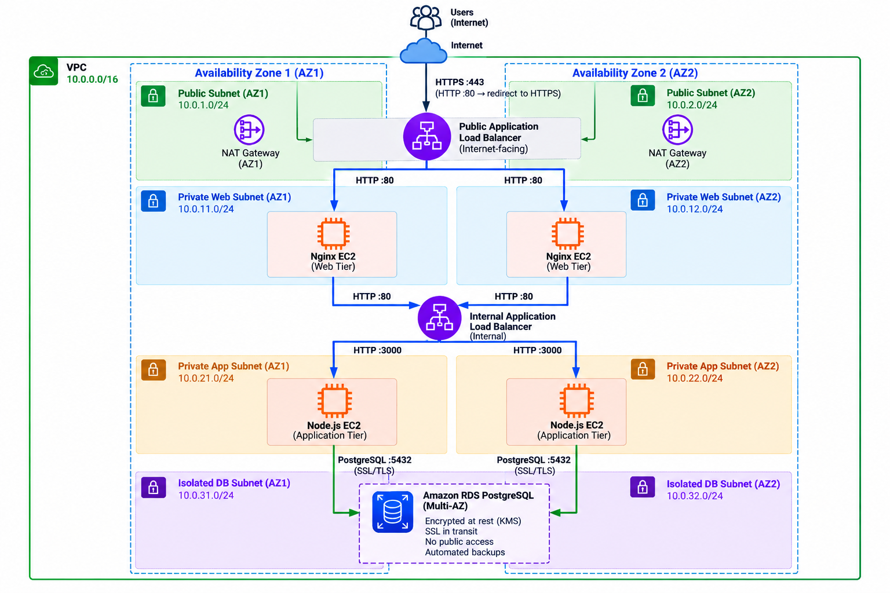
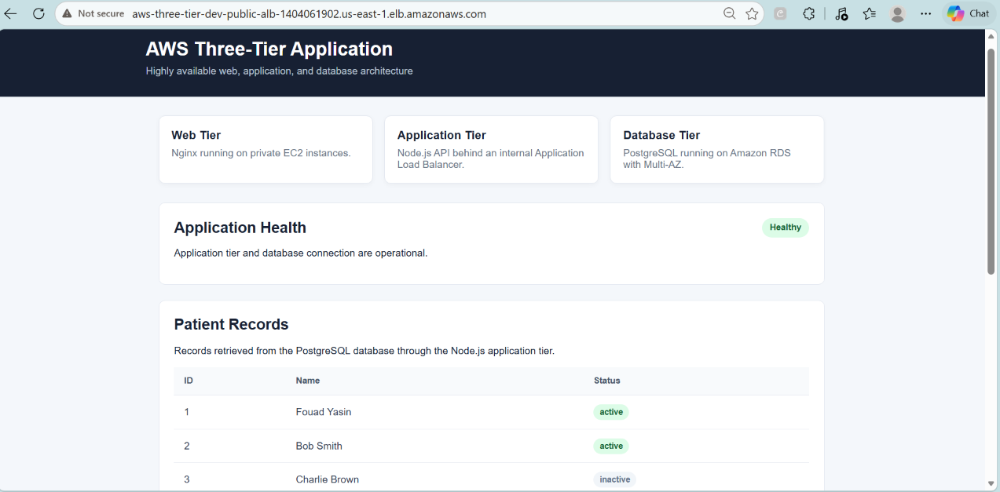
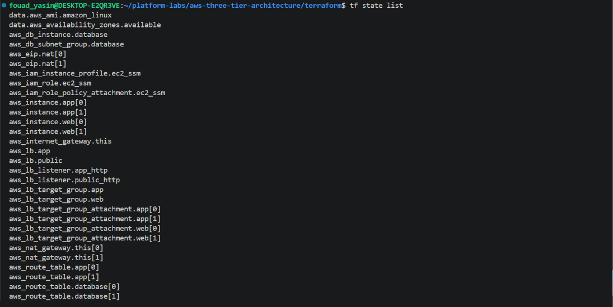
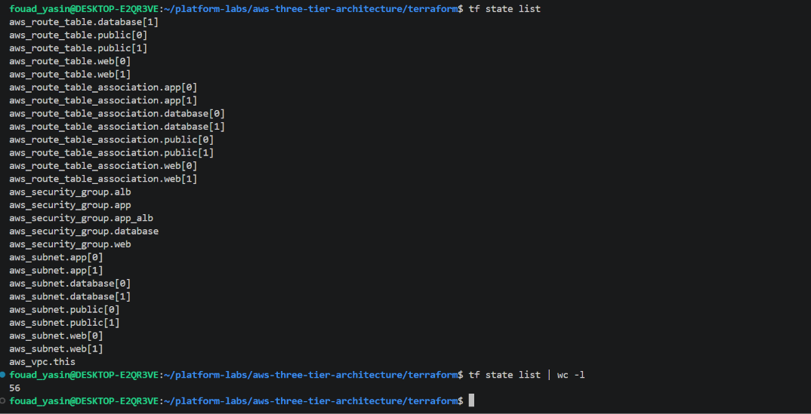
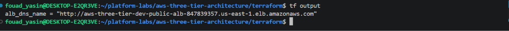

# AWS Three-Tier Architecture

> A production-oriented, highly available three-tier AWS application built with Terraform and deployed across two Availability Zones.

## Overview

This project implements a complete three-tier application architecture on AWS with clear separation between the web, application, and database layers.

The deployment includes:

- A VPC spanning two Availability Zones
- Public, private web, private application, and isolated database subnets
- An internet-facing Application Load Balancer
- Nginx web servers running on private EC2 instances
- An internal Application Load Balancer
- Node.js application servers running on private EC2 instances
- Amazon RDS PostgreSQL with Multi-AZ deployment
- NAT Gateways for private-tier outbound connectivity
- Least-privilege security groups between application tiers
- AWS Systems Manager access for EC2 management
- Encryption at rest for RDS and SSL/TLS for application-to-database traffic

## Architecture



### Network Layout

| Tier | Availability Zone 1 | Availability Zone 2 |
|---|---|---|
| Public | `10.0.1.0/24` | `10.0.2.0/24` |
| Private Web | `10.0.11.0/24` | `10.0.12.0/24` |
| Private App | `10.0.21.0/24` | `10.0.22.0/24` |
| Isolated Database | `10.0.31.0/24` | `10.0.32.0/24` |

The VPC uses the `10.0.0.0/16` CIDR range.

### Request Flow

```text
Internet
   |
   | HTTP :80
   v
Public Application Load Balancer
   |
   | HTTP :80
   v
Nginx Web Tier
   |
   | HTTP :80
   v
Internal Application Load Balancer
   |
   | HTTP :3000
   v
Node.js Application Tier
   |
   | PostgreSQL :5432 (SSL/TLS)
   v
Amazon RDS PostgreSQL
```

The public ALB is the only internet-facing application component. The web and application servers run in private subnets, while the database is deployed in isolated subnets without a default Internet route.

## Deployment Verification

The infrastructure was successfully deployed to AWS with Terraform and the application was verified through the public Application Load Balancer.

### Running Application

The application was successfully accessed through the public ALB. The frontend confirms application health and retrieves patient records through the Node.js API and PostgreSQL database.



This verifies the complete application path:

```text
Public ALB
    ↓
Nginx Web Tier
    ↓
Internal ALB
    ↓
Node.js Application
    ↓
PostgreSQL RDS
```

### Terraform State

After deployment, Terraform reported **56 state entries**. The complete `terraform state list` output spans two screenshots because of the number of resources and data sources tracked in the state.





### Public Application Load Balancer

The public ALB DNS name was retrieved from the Terraform output:

```bash
terraform output alb_dns_name
```



The returned DNS name provides the public entry point to the deployed application.


## Run the Project

### Prerequisites

- AWS account with permissions to create the required resources
- AWS CLI configured with valid credentials
- Terraform `>= 1.9.0`

### Clone the Repository

```bash
git clone https://github.com/fouadyasin01/platform-labs.git
cd platform-labs/aws-three-tier-architecture
```

### Initialize Terraform

```bash
cd terraform
terraform init
```

### Review the Deployment Plan

```bash
terraform plan
```

### Deploy the Infrastructure

```bash
terraform apply
```

Terraform provisions the complete three-tier environment, including networking, load balancers, EC2 instances, security groups, NAT Gateways, and the PostgreSQL RDS database.

### Retrieve the Application URL

After deployment:

```bash
terraform output alb_dns_name
```

Open the returned ALB DNS name in a browser to access the application.

### Destroy the Environment

When the environment is no longer required:

```bash
terraform destroy
```

## Design Choice

An Auto Scaling Group (ASG) could have been added to automatically scale the web and application tiers based on demand.

For this project, I intentionally kept the infrastructure simpler and focused on demonstrating the core three-tier architecture, multi-AZ deployment, load balancing, network segmentation, security-group isolation, and database high availability.

The architecture still uses two EC2 instances per application tier across two Availability Zones, providing redundancy while keeping the Terraform implementation straightforward.

## Security

Traffic between tiers is restricted using dedicated security groups:

| Source | Destination | Port | Purpose |
|---|---|---:|---|
| Internet | Public ALB | `80` | Public application access |
| Public ALB | Nginx EC2 | `80` | Frontend traffic |
| Nginx EC2 | Internal ALB | `80` | API forwarding |
| Internal ALB | Node.js EC2 | `3000` | Application API |
| Node.js EC2 | RDS PostgreSQL | `5432` | Database access |

The database is not publicly accessible and accepts PostgreSQL connections only from the application tier.

RDS storage encryption is enabled, and application-to-database communication uses SSL/TLS.

For the detailed security design, see [`SECURITY-DESIGN.md`](SECURITY-DESIGN.md).

## Documentation

- [`architecture-diagram.md`](architecture-diagram.md) — detailed architecture and network design
- [`SECURITY-DESIGN.md`](SECURITY-DESIGN.md) — security groups, credential handling, isolation, and encryption

## Repository Structure

```text
.
├── app/
│   ├── api/
│   │   ├── db.js
│   │   ├── package.json
│   │   ├── schema.sql
│   │   └── server.js
│   └── web/
│       ├── index.html
│       └── nginx.conf.template
├── docs/
│   ├── architecture-diagram.png
│   ├── aws-three-tier-online.png
│   ├── terraform-state-1.png
│   ├── terraform-state-2.png
│   └── tf-output.png
├── terraform/
├── architecture-diagram.md
├── SECURITY-DESIGN.md
└── README.md
```

## Technologies

- **AWS**
- **Terraform**
- **Amazon VPC**
- **Application Load Balancer**
- **Amazon EC2**
- **Nginx**
- **Node.js**
- **PostgreSQL**
- **Amazon RDS**
- **AWS Systems Manager**

## Project Outcome

The project demonstrates a complete AWS three-tier deployment from infrastructure provisioning to a working application.

**Architecture → Terraform provisioning → Load balancing → Application tier → Database → Verified running application**
