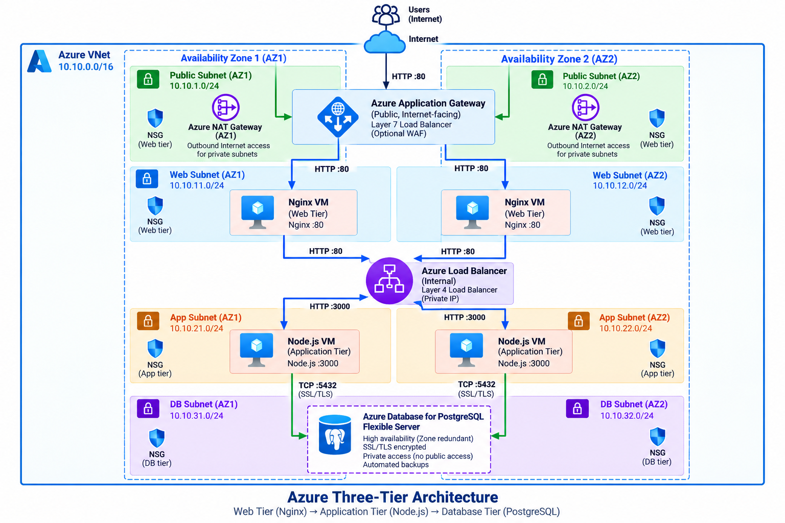
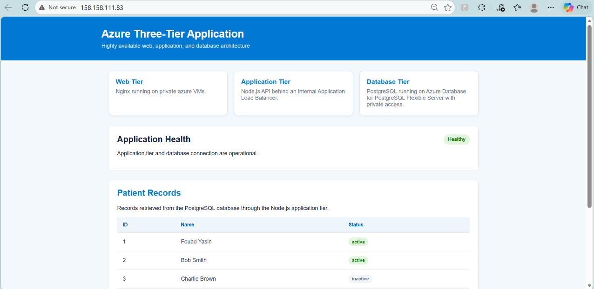
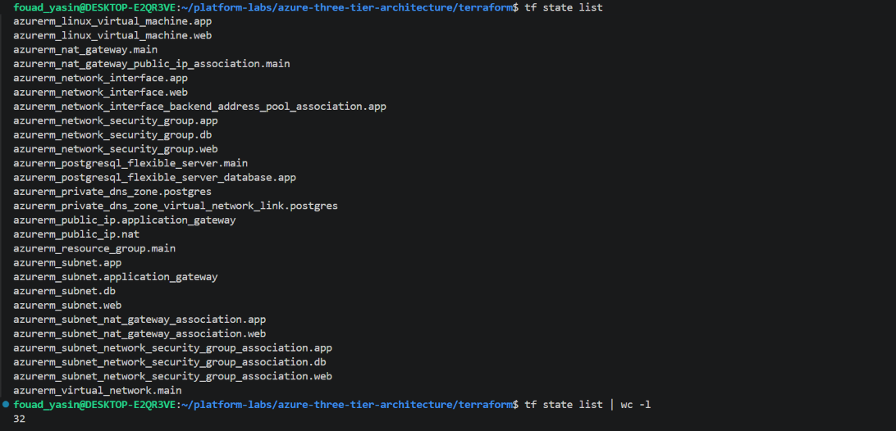

# Azure Three-Tier Architecture

Terraform implementation of a three-tier application on Microsoft Azure, replicating the architecture previously deployed on AWS   in the [`aws-three-tier-architecture`](../aws-three-tier-architecture) project.


## Architecture




## Deployment Verification

The deployed application is publicly reachable through Azure Application Gateway.

**Live application:** http://158.158.111.83

The following screenshot provides proof that the Azure deployment is operational and that patient records are being retrieved through the Node.js application tier from PostgreSQL.



The application displays:

- Azure Three-Tier Application
- Healthy application status
- Web, application, and database tiers
- Patient records retrieved from PostgreSQL through Node.js

## Terraform State

The deployed infrastructure is managed by Terraform. The current state contains 32 Azure resources.



The state includes resources for:

- Virtual network and subnets
- Application Gateway
- Internal Load Balancer
- Web and application VMs
- Network interfaces
- Network Security Groups
- NAT Gateway
- PostgreSQL Flexible Server
- PostgreSQL database
- Private DNS
- Resource group


### Traffic flow

```text
Internet
    |
    v
Azure Application Gateway :80
    |
    v
Private Web Tier
Nginx :80
    |
    v
Internal Azure Load Balancer :80
    |
    v
Private Application Tier
Node.js :3000
    |
    v
Azure Database for PostgreSQL Flexible Server :5432
```

### Tier responsibilities

| Tier | Azure Services | Role |
|---|---|---|
| Network | Azure VNet, subnets, NSGs, NAT Gateway, Private DNS | Network isolation, traffic control, private DNS, and outbound connectivity |
| Web | Azure VM + Nginx | Serves the frontend and proxies `/api/` requests |
| Application | Azure VM + Node.js | Runs the REST API |
| Load Balancing | Azure Application Gateway + Internal Azure Load Balancer | Public Layer 7 entry point and private application-tier load balancing |
| Database | Azure Database for PostgreSQL Flexible Server | Managed PostgreSQL database with private access |

## Terraform

The infrastructure is managed with Terraform using the `azurerm` provider.

### Main resources

- Azure Resource Group
- Azure Virtual Network
- Web, application, and database subnets
- Network Security Groups
- Azure Application Gateway
- Internal Azure Load Balancer
- NAT Gateway
- Azure Linux Virtual Machines
- Azure Database for PostgreSQL Flexible Server
- PostgreSQL database
- Private DNS zone and VNet link

### Repository structure

```text
.
├── app/
│   ├── api/
│   └── web/
├── docs/
│   └── images/
├── terraform/
│   ├── provider.tf
│   ├── variables.tf
│   ├── network.tf
│   ├── nsg.tf
│   ├── lb.tf
│   ├── web.tf
│   ├── app.tf
│   ├── database.tf
│   ├── outputs.tf
│   └── user-data/
│       ├── web.sh.tftpl
│       └── app.sh.tftpl
├── aws-to-azure-mapping.md
├── COMPARISON.md
└── README.md
```

## Application

The application keeps the same core application logic as the AWS implementation:

- Nginx frontend
- Node.js REST API
- PostgreSQL database
- Patient records retrieved through the API
- Private application and database tiers

The Azure implementation changes the infrastructure layer while preserving the application architecture.


## Clone and Run the Project

### 1. Clone the repository

```bash
git clone https://github.com/fouadyasin01/platform-labs.git
cd platform-labs/azure-three-tier-architecture/terraform
```

### 2. Initialize Terraform

```bash
terraform init
```

### 3. Format and validate the Terraform configuration

```bash
terraform fmt -check -recursive
terraform validate
```

### 4. Review the infrastructure plan

```bash
terraform plan
```

### 5. Deploy the Azure infrastructure

```bash
terraform apply
```
Review the proposed changes and enter `yes` when prompted.

## AWS to Azure Mapping

See [aws-to-azure-mapping.md](aws-to-azure-mapping.md) for the service-by-service mapping and architectural differences.

## AWS vs Azure Comparison

See [COMPARISON.md](COMPARISON.md) for the platform comparison and recommendation.

## Project Goal

The goal of this project is to demonstrate the ability to translate an existing AWS three-tier architecture into Azure while understanding the equivalent cloud services, networking model, security controls, and managed database options.
