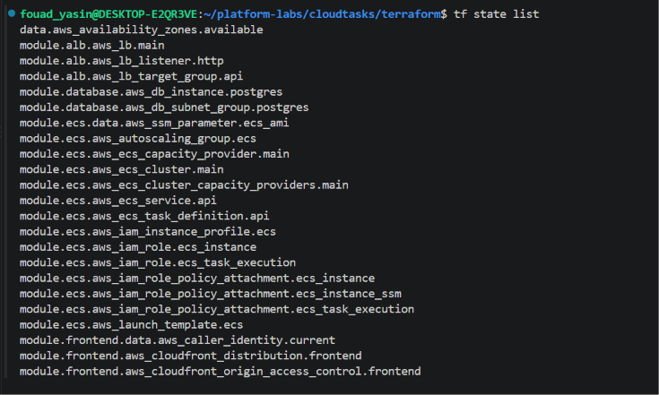
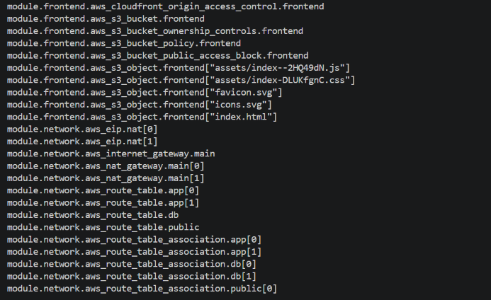
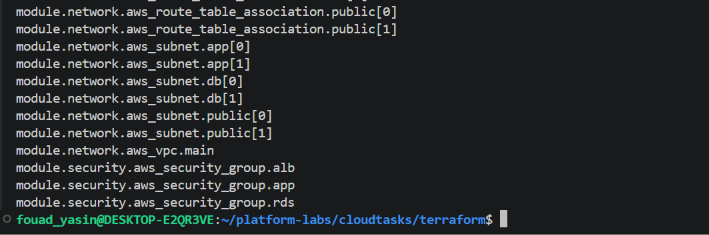
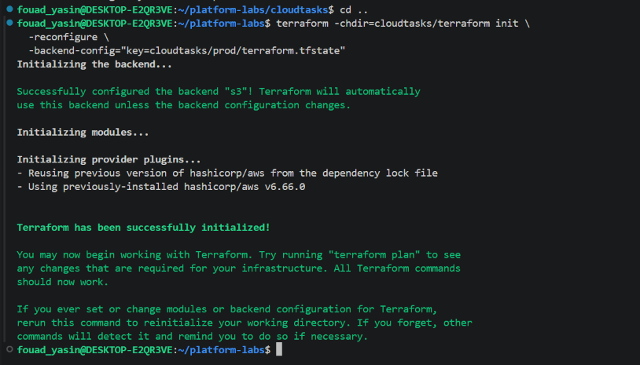
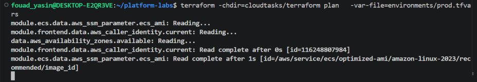
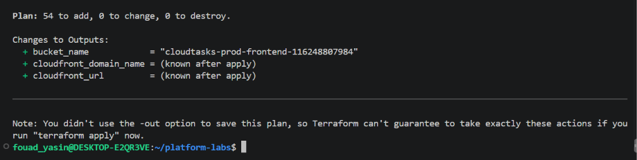

# CloudTasks

> **Containerized SaaS application and multi-environment AWS platform built with Terraform.**

CloudTasks is a full-stack task management application built with **React/Vite, Node.js/Express, and PostgreSQL**, together with the AWS platform required to run it as a scalable and resilient workload.

The project focuses on **Infrastructure as Code (IaC)**: the AWS infrastructure is defined with **Terraform**, organized into reusable modules, and designed to support **development, staging, and production** from the same codebase.

**Stack:** React · Vite · Node.js · Express · PostgreSQL · Docker · Terraform · AWS

---

## Architecture

CloudTasks is built around three application layers:

| Layer | Implementation | AWS |
|---|---|---|
| **Frontend** | React / Vite | Amazon S3 + CloudFront |
| **Application** | Node.js / Express + Docker | ALB + ECS on EC2 |
| **Data** | PostgreSQL | Amazon RDS |


### Traffic flow

```text
                         CloudFront
                        /          \
                       /            \
              Static assets         /api/*
                    |                 |
                    v                 v
               Amazon S3            ALB
              React assets            |
                                      v
                                ECS on EC2
                                      |
                                      v
                               RDS PostgreSQL
```

The frontend and API are deliberately separated: CloudFront serves the React application from S3, while `/api/*` requests are routed to the Application Load Balancer and then to the ECS service.

### Platform

The application runs on an AWS platform consisting of:

- VPC across **two Availability Zones**
- Public, private application, and private database subnets
- Application Load Balancer
- ECS on EC2
- EC2 Auto Scaling Group
- ECS capacity provider
- **RDS PostgreSQL Multi-AZ**
- Security Groups and IAM
- ACM / TLS
- CloudWatch

---

## Resilience & Availability

The platform was designed with resilience in mind rather than treating the application as a single-server deployment.

### Multi-AZ application architecture

```text
                 AWS VPC
              /           \
             /             \
           AZ-A            AZ-B
            |                |
         ECS/EC2          ECS/EC2
         API tasks        API tasks
            \                /
             \              /
                  ALB
                   |
                   v
             RDS PostgreSQL
                Multi-AZ
```

The ECS service maintains multiple API tasks, while EC2 capacity is provided through an Auto Scaling Group.

```text
Minimum capacity:   2
Desired capacity:   2
Maximum capacity:   4
```

The ALB uses `/api/health` health checks to route traffic to healthy API targets.

PostgreSQL runs on **Amazon RDS with Multi-AZ enabled**, separating database availability from the application container lifecycle.

The architecture also separates public, private application, and private database tiers, with security groups controlling traffic between layers.

---

# Deployment Evidence

The **DEV environment** was successfully deployed and tested on AWS through the CloudFront distribution.

> The DEV environment may be destroyed after testing to avoid unnecessary cloud costs. The screenshots document the deployed DEV environment and its Terraform-managed infrastructure at the time of deployment.


Terraform state contained approximately **54 managed resources** for the deployed environment.







---

# Production Terraform Plan Evidence

The production environment was initialized and validated independently using its own backend state and variable configuration.

## 1. Production backend

```bash
terraform init \
  -reconfigure \
  -backend-config="key=cloudtasks/prod/terraform.tfstate"
```



## 2. Production plan

```bash
terraform plan \
  -var-file=environments/prod.tfvars
```



## 3. Plan result

```text
Plan: 54 to add, 0 to change, 0 to destroy.
```



This demonstrates that the production environment can be represented and validated entirely through the Terraform configuration.

---

# Infrastructure as Code

**Terraform is the foundation of the platform.**

The AWS infrastructure is defined as reusable modules rather than manually provisioned resources.

```text
cloudtasks/terraform/
├── main.tf
├── variables.tf
├── outputs.tf
├── versions.tf
│
├── environments/
│   ├── dev.tfvars
│   ├── staging.tfvars
│   └── prod.tfvars
│
└── modules/
    ├── network/
    ├── security/
    ├── alb/
    ├── ecs/
    ├── database/
    └── frontend/
```

| Module | Responsibility |
|---|---|
| `network` | VPC, Availability Zones, subnets and routing |
| `security` | Security groups and network access rules |
| `alb` | Application Load Balancer and target group |
| `ecs` | ECS service, EC2 capacity, Auto Scaling and capacity provider |
| `database` | RDS PostgreSQL |
| `frontend` | S3 and CloudFront |

Terraform also manages environment-aware naming, common tags, variable validation, remote state, state locking, and infrastructure lifecycle.

---

# Multi-Environment Infrastructure

The same Terraform modules are reused across:

```text
DEV  →  STAGING  →  PROD
```

Each environment has its own configuration:

```text
environments/
├── dev.tfvars
├── staging.tfvars
└── prod.tfvars
```

and its own remote state:

```text
cloudtasks/dev/terraform.tfstate
cloudtasks/staging/terraform.tfstate
cloudtasks/prod/terraform.tfstate
```

### State vs. configuration

```text
-backend-config="key=..."
        |
        +--> selects remote Terraform state

-var-file=environments/...
        |
        +--> selects environment configuration
```

Example:

```bash
terraform init \
  -reconfigure \
  -backend-config="key=cloudtasks/dev/terraform.tfstate"

terraform plan \
  -var-file=environments/dev.tfvars
```

---

# Application

## Frontend

The frontend is a React/Vite application.

```bash
cd cloudtasks/frontend
npm install
npm run dev
```

Create a production build:

```bash
npm run build
```

The build is generated in:

```text
cloudtasks/frontend/dist/
```

Terraform deploys these assets to S3 for CloudFront delivery.

## Backend

The backend is a **Node.js/Express REST API packaged as a Docker image**.

AWS uses the public pre-built image:

```text
vanbasten01/cloudtasks-api:1.1
```

No backend image build is required for the Terraform deployment.

The ECS task receives:

```text
PORT
DB_HOST
DB_PORT
DB_NAME
DB_USER
DB_PASSWORD
```

For local development, configuration is supplied through `.env` based on `.env.example`.

## Database

PostgreSQL is the persistent data layer.

```text
Local development  → Docker Compose
AWS deployment     → Amazon RDS PostgreSQL
```

---

# Clone & Run Locally

Clone the repository:

```bash
git clone https://github.com/fouadyasin01/platform-labs.git
cd platform-labs/cloudtasks
```

Start PostgreSQL:

```bash
docker compose up -d
docker compose ps
```

Run the frontend:

```bash
cd frontend
npm install
npm run dev
```

For local backend development, use the project's `.env.example` as the template for `.env`.

The published AWS backend image is:

```text
vanbasten01/cloudtasks-api:1.1
```

Test the API health endpoint:

```bash
curl http://localhost:3000/api/health
```

---

# Terraform Deployment

From the Terraform directory:

```bash
cd cloudtasks/terraform
```

Configure the selected `.tfvars` file with the required values. Do not commit real credentials or secrets.

### Initialize

```bash
terraform init \
  -reconfigure \
  -backend-config="key=cloudtasks/dev/terraform.tfstate"
```

### Plan

```bash
terraform plan \
  -var-file=environments/dev.tfvars
```

### Apply

```bash
terraform apply \
  -var-file=environments/dev.tfvars
```

Replace `dev` with `staging` or `prod` when required.

### Destroy

Always reconfigure the backend to the target environment before destroying it:

```bash
terraform init \
  -reconfigure \
  -backend-config="key=cloudtasks/dev/terraform.tfstate"

terraform destroy \
  -var-file=environments/dev.tfvars
```

This prevents accidentally operating against the wrong environment's state.

---

# Project Structure

```text
cloudtasks/
├── backend/
│   ├── src/
│   ├── package.json
│   └── ...
│
├── frontend/
│   ├── src/
│   ├── package.json
│   └── ...
│
├── docker-compose.yml
│
└── terraform/
    ├── main.tf
    ├── variables.tf
    ├── outputs.tf
    ├── versions.tf
    ├── environments/
    │   ├── dev.tfvars
    │   ├── staging.tfvars
    │   └── prod.tfvars
    │
    └── modules/
        ├── network/
        ├── security/
        ├── alb/
        ├── ecs/
        ├── database/
        └── frontend/
```

---

# What This Project Demonstrates

### Application Engineering

React · Vite · Node.js · Express · REST API · PostgreSQL · Docker

### AWS Architecture

VPC · Multi-AZ networking · Public/private subnet segmentation · ALB · ECS on EC2 · EC2 Auto Scaling · ECS capacity providers · RDS PostgreSQL Multi-AZ · S3 · CloudFront · IAM · ACM · CloudWatch

### Infrastructure as Code

Terraform · Reusable modules · Environment-specific configuration · Variable validation · Remote S3 state · State locking · Environment isolation · Infrastructure lifecycle management

---

## Project Focus

> **Build the platform around the application.**

CloudTasks demonstrates how a full-stack application can be turned into a **reproducible, multi-environment AWS platform**.

The application layers are backed by infrastructure providing:

- multi-AZ deployment
- redundant application capacity
- health-based traffic routing
- EC2 scaling
- managed database availability
- private application and database tiers
- environment-specific Terraform state
- reproducible infrastructure through IaC

The result is a project where both the **application and the platform required to operate it are designed, provisioned, and managed as code**.
