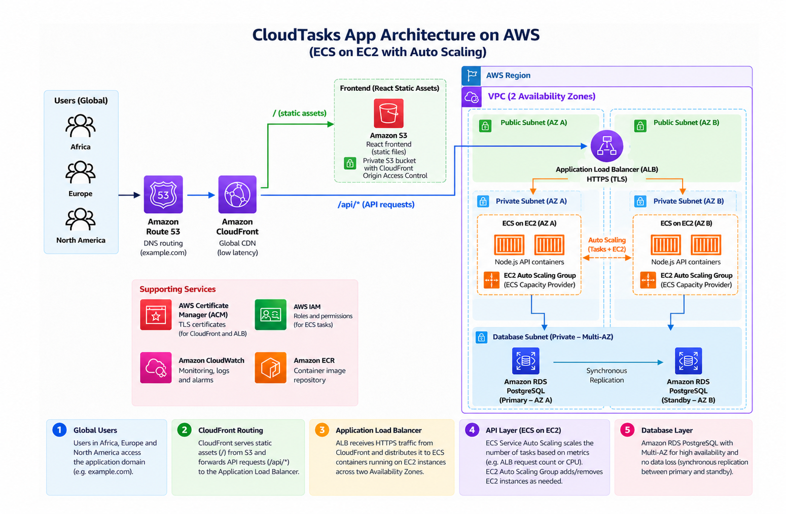
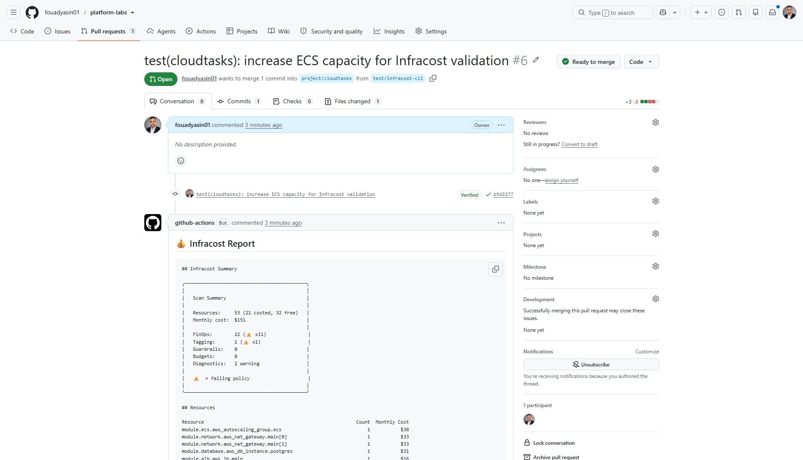
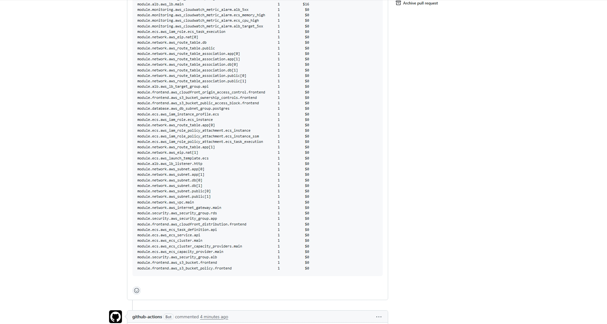
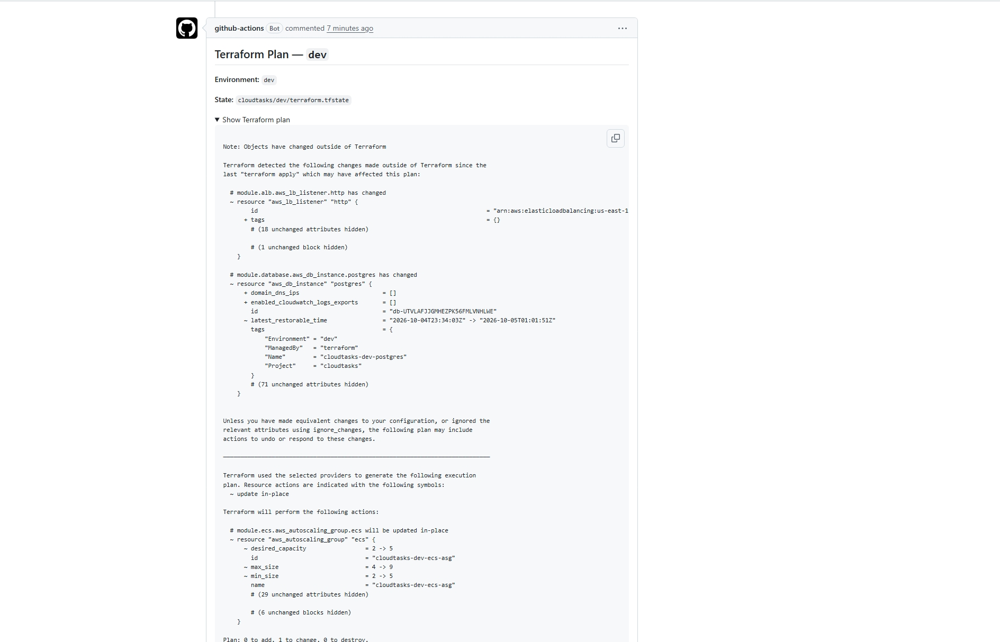
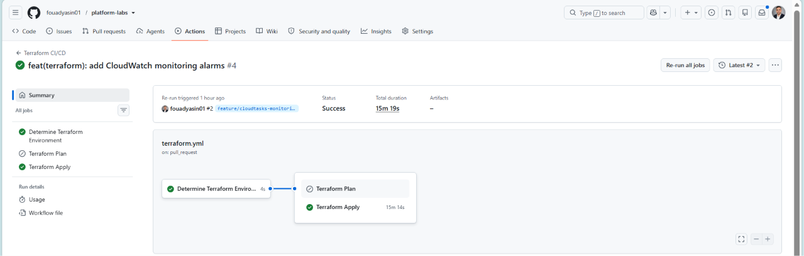
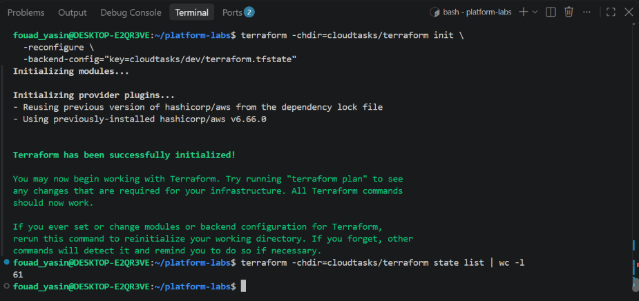
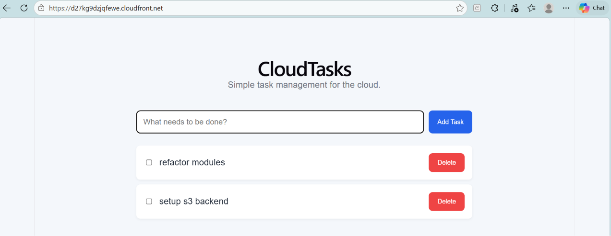

# CloudTasks

> ******A multi-environment AWS platform for a containerized SaaS application, engineered as Infrastructure as Code with Terraform and delivered through GitHub Actions.******

CloudTasks combines a React/Vite frontend, Node.js/Express API, PostgreSQL, Docker, and a modular AWS platform. The project focuses on ******reproducible infrastructure, secure CI/CD, observability, environment isolation, and FinOps visibility******.

## AWS Platform



The platform is organized around a multi-AZ AWS architecture:

| Layer | Implementation |
|---|---|
| Frontend | React/Vite → S3 + CloudFront |
| API | Node.js/Express → Docker → ECS on EC2 |
| Traffic | Application Load Balancer |
| Compute | ECS on EC2 + Auto Scaling + Capacity Provider |
| Database | Amazon RDS PostgreSQL Multi-AZ |
| Networking | VPC, public/private subnets, routing, security groups |
| Monitoring | Amazon CloudWatch alarms managed with Terraform |
| Infrastructure | Terraform modules + environment-specific configuration |
| CI/CD | GitHub Actions + Terraform Plan/Apply |
| AWS authentication | GitHub OIDC → IAM role |
| State | S3 remote state + native Terraform state locking |
| FinOps | Infracost |


---


### CI/CD workflow:

`.github/workflows/terraform.yml` generates a Terraform plan when a pull request is opened or updated. `.github/workflows/infracost.yml` generates the Infracost cost report for the proposed infrastructure changes. After the pull request is reviewed and merged, the Terraform pipeline runs **Terraform Apply** to deploy the approved changes.

**PR workflow:**        **Pull Request → Terraform Plan + Infracost cost report → Review & Merge → Terraform Apply**

### Multi-environment design

The same Terraform modules are reused across:

```text

DEV  →  STAGING  →  PROD

```

Each environment has independent configuration and remote state:

```text

cloudtasks/dev/terraform.tfstate

cloudtasks/staging/terraform.tfstate

cloudtasks/prod/terraform.tfstate

```

### Platform highlights

- ******Reusable Terraform modules****** for networking, security, ALB, ECS, database, frontend, and monitoring.

- ******GitHub OIDC****** for short-lived AWS credentials instead of long-lived access keys.

- ******Plan-before-apply CI/CD****** with environment-aware Terraform state.

- ******CloudWatch monitoring as code******, including ECS and ALB health/performance alarms.

- ******Infracost****** for infrastructure cost visibility before deployment.

## Evidence

The project includes direct evidence from the GitHub Actions and Terraform workflow, demonstrating ******cost visibility and infrastructure changes being reviewed before deployment******.

### Infracost — Cost Summary and  Resource-Level Cost Breakdown

The pull request receives an automated Infracost report with the estimated monthly infrastructure cost. The captured run reports ******53 resources******, including ******21 costed resources******, with an estimated ******$151/month****** cost for the analyzed environment.

[](docs/pr-rapport-1.jpeg)

[](docs/pr-rapport-2.jpeg)

### Terraform Plan — Pull Request Review

Terraform changes are appended directly to the pull request before deployment. The example below shows the ******DEV environment******, its isolated remote state, and the planned ECS capacity change reviewed by GitHub Actions.

[](docs/pr-rapport-3.jpeg)

### Example of CloudWatch set through the pipeline 

****CloudWatch alarms are managed as Terraform code and deployed through the infrastructure pipeline after PR review and merge.****

[](docs/cloudwatch-apply-success.png)

### Terraform State — 61 Managed Resources

After integrating the CloudWatch monitoring layer, the DEV Terraform state contains ******61 managed resources******, demonstrating that the monitoring additions were incorporated into the existing infrastructure rather than deployed separately.

[](docs/state-after-cw.png)

### DEV Environment — Live AWS Deployment

The ******DEV environment****** was successfully deployed and tested on AWS through the CloudFront distribution.

> The DEV environment may be destroyed after testing to avoid unnecessary cloud costs. The screenshot documents the deployed DEV environment and its Terraform-managed infrastructure at the time of deployment.



## Infrastructure as Code

Terraform is the foundation of the platform. AWS networking, security, load balancing, ECS capacity, database, frontend delivery, and monitoring are defined through reusable modules and environment-specific configuration.

```text

cloudtasks/terraform/

├── environments/
│   ├── dev.tfvars
│   ├── staging.tfvars
│   └── prod.tfvars
└── modules/
    ├── network/
    ├── security/
    ├── alb/
    ├── ecs/
    ├── database/
    ├── frontend/
    └── monitoring/

```

## Multi-Environment Infrastructure

The same Terraform modules are reused across:

```text

DEV  →  STAGING  →  PROD

```

Each environment has its own configuration:

```text

environments/

├── dev.tfvars

├── staging.tfvars

└── prod.tfvars

```

and its own remote state:

```text

cloudtasks/dev/terraform.tfstate

cloudtasks/staging/terraform.tfstate

cloudtasks/prod/terraform.tfstate

```

### State vs. configuration

```text

-backend-config="key=..."

        |

        +--> selects remote Terraform state

-var-file=environments/...

        |

        +--> selects environment configuration

```

Example:

```bash

terraform init 

  -reconfigure 

  -backend-config="key=cloudtasks/staging/terraform.tfstate"

terraform plan 

  -var-file=environments/staging.tfvars

```

****---****

## Application

## Frontend

The frontend is a React/Vite application.

```bash

cd cloudtasks/frontend

npm install

npm run dev

```

Create a production build:

```bash

npm run build

```

The build is generated in:

```text

cloudtasks/frontend/dist/

```

Terraform deploys these assets to S3 for CloudFront delivery.

## Backend

The backend is a ******Node.js/Express REST API packaged as a Docker image******.

AWS uses the public pre-built image:

```text

vanbasten01/cloudtasks-api:1.1

```

No backend image build is required for the Terraform deployment.

The ECS task receives:

```text

PORT

DB_HOST

DB_PORT

DB_NAME

DB_USER

DB_PASSWORD

```

For local development, configuration is supplied through `.env` based on `.env.example`.

## Database

PostgreSQL is the persistent data layer.

```text

Local development  → Docker Compose

AWS deployment     → Amazon RDS PostgreSQL

```

****---****

## Clone & Run Locally

Clone the repository:

```bash

git clone https://github.com/fouadyasin01/platform-labs.git

cd platform-labs/cloudtasks

```

Start PostgreSQL:

```bash

docker compose up -d

docker compose ps

```

Run the frontend:

```bash

cd frontend

npm install

npm run dev

```

For local backend development, use the project's `.env.example` as the template for `.env`.

The published AWS backend image is:

```text

vanbasten01/cloudtasks-api:1.1

```

Test the API health endpoint:

```bash

curl http://localhost:3000/api/health

```

****---****

## Terraform Deployment

## Clone & Run Locally

Clone the repository:

```bash

git clone https://github.com/fouadyasin01/platform-labs.git

cd platform-labs/cloudtasks

```

Run the frontend:

```bash

cd cloudtasks/frontend

npm install

npm run dev

```

From the Terraform directory:

```bash

cd cloudtasks/terraform

```

Configure the selected `.tfvars` file with the required values. Do not commit real credentials or secrets.

### Initialize

```bash

terraform init 

  -reconfigure 

  -backend-config="key=cloudtasks/dev/terraform.tfstate"

```

### Plan

```bash

terraform plan 

  -var-file=environments/dev.tfvars

```

### Apply

```bash

terraform apply 

  -var-file=environments/dev.tfvars

```

Replace `dev` with `staging` or `prod` when required.

### Destroy

Always reconfigure the backend to the target environment before destroying it:

```bash

terraform init 

  -reconfigure 

  -backend-config="key=cloudtasks/dev/terraform.tfstate"

terraform destroy 

  -var-file=environments/dev.tfvars

```

This prevents accidentally operating against the wrong environment's state.

****---****

## Project Structure

```text
cloudtasks/
├── backend/
│   ├── src/
│   ├── package.json
│   └── ...
│
├── frontend/
│   ├── src/
│   ├── package.json
│   └── ...
│
├── docker-compose.yml
│
└── terraform/
    ├── main.tf
    ├── variables.tf
    ├── outputs.tf
    ├── versions.tf
    ├── environments/
    │   ├── dev.tfvars
    │   ├── staging.tfvars
    │   └── prod.tfvars
    │
    └── modules/
        ├── network/
        ├── security/
        ├── alb/
        ├── ecs/
        ├── database/
        └── frontend/
        └── monitoring/

```

****---****

## What This Project Demonstrates

### Application Engineering

React · Vite · Node.js · Express · REST API · PostgreSQL · Docker

### AWS Architecture

VPC · Multi-AZ networking · Public/private subnet segmentation · ALB · ECS on EC2 · EC2 Auto Scaling · ECS capacity providers · RDS PostgreSQL Multi-AZ · S3 · CloudFront · IAM · ACM · CloudWatch

### Infrastructure as Code

Terraform · Reusable modules · Environment-specific configuration · Variable validation · Remote S3 state · State locking · Environment isolation · Infrastructure lifecycle management

****---****

## Project Focus

> ******Build the platform around the application.******

CloudTasks demonstrates how a full-stack application can be turned into a ******reproducible, multi-environment AWS platform******.

The application layers are backed by infrastructure providing:

- multi-AZ deployment

- redundant application capacity

- health-based traffic routing

- EC2 scaling

- managed database availability

- private application and database tiers

- environment-specific Terraform state

- reproducible infrastructure through IaC

- cloudwatch alarm set for monitoring 

The result is a project where both the ******application and the platform required to operate it are designed, provisioned, and managed as code******.
