# Linux Multi-Service Environment

> **A reproducible Linux service environment provisioned end-to-end with modular Bash automation.**

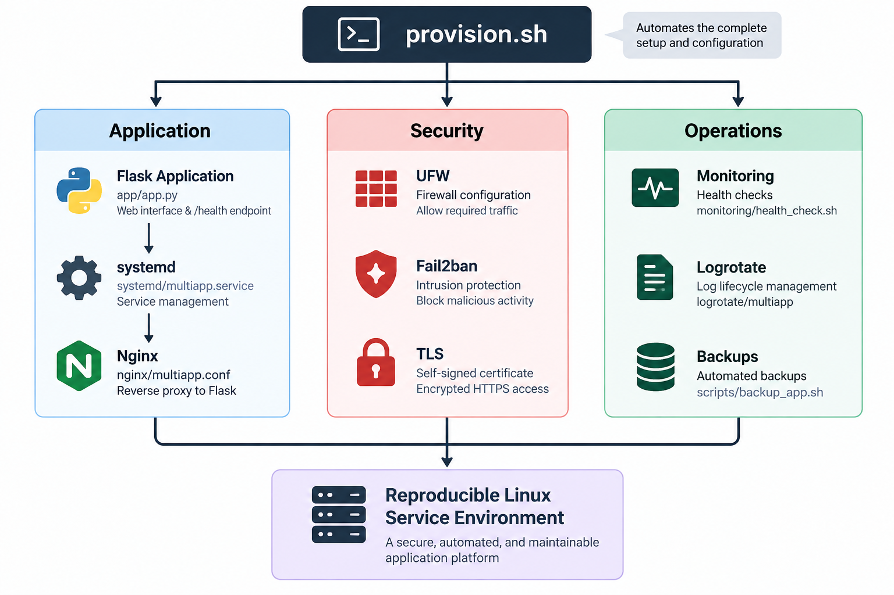

A complete Linux application environment automated through a single entry point:

```bash
sudo ./provision.sh
```

It covers the application, **systemd service management, Nginx reverse proxy, TLS, UFW firewalling, Fail2ban intrusion protection, DNS validation, health monitoring, log rotation, and automated backups.**

The project is designed around a simple principle:

> **Provision the environment once, automate its operational lifecycle, and make every major capability verifiable.**

---

## Deployment

The project can be deployed on a fresh Ubuntu/Debian server.

Clone the repository:

```bash
git clone https://github.com/fouadyasin01/platform-labs.git
cd linux-multi-service-environment
```

Run the complete provisioning workflow:

```bash
sudo ./provision.sh
```

`provision.sh` is the single orchestration entry point. It validates the environment and then delegates each responsibility to a dedicated provisioning module.

```text
provision.sh
│
├── Environment validation
├── Dependency installation
├── Application user
├── Flask backend
├── systemd service
├── TLS
├── Nginx
├── UFW firewall
├── Fail2ban
├── DNS verification
├── Health monitoring
├── Log rotation
└── Backups
```

No manual component-by-component configuration is required after starting the provisioning workflow.

---

## Application

The application is a Flask service running locally on the server and exposed through Nginx.

```text
Client
  │
  ▼
Nginx
  │
  ▼
Flask
127.0.0.1:3000
```

The application provides:

| Endpoint | Purpose |
|---|---|
| `/` | Application interface |
| `/health` | JSON health endpoint |

### Deployment Evidence

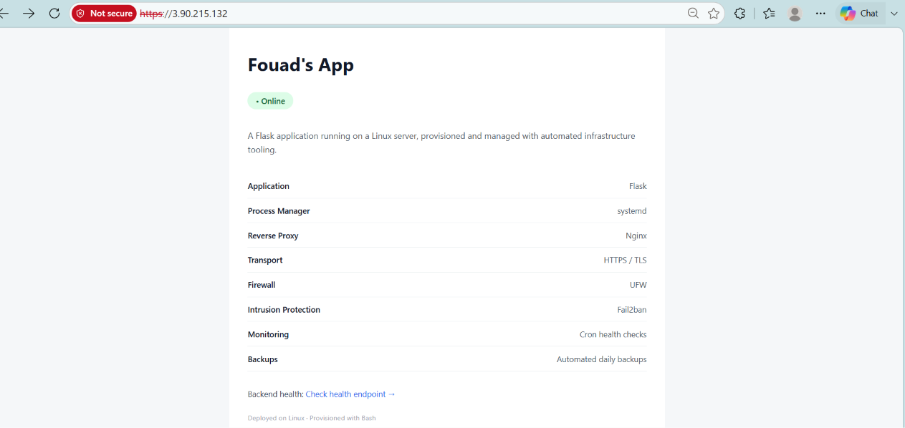

The screenshot demonstrates the application successfully deployed and served through the configured environment.

---

## Provisioning Architecture

The project deliberately separates orchestration from implementation.

`provision.sh` coordinates the deployment while individual scripts own specific infrastructure concerns:

```text
provision.sh
│
├── scripts/install_dependencies.sh
├── scripts/setup_app_user.sh
├── scripts/setup_backend.sh
├── scripts/setup_systemd.sh
├── scripts/setup_tls.sh
├── scripts/setup_nginx.sh
├── scripts/setup_firewall.sh
├── scripts/setup_fail2ban.sh
├── scripts/verify_dns.sh
├── scripts/setup_monitoring.sh
├── scripts/setup_logrotate.sh
└── scripts/setup_backup.sh
```

This modular structure keeps the provisioning workflow understandable, maintainable, and extensible.

### Provisioning Evidence

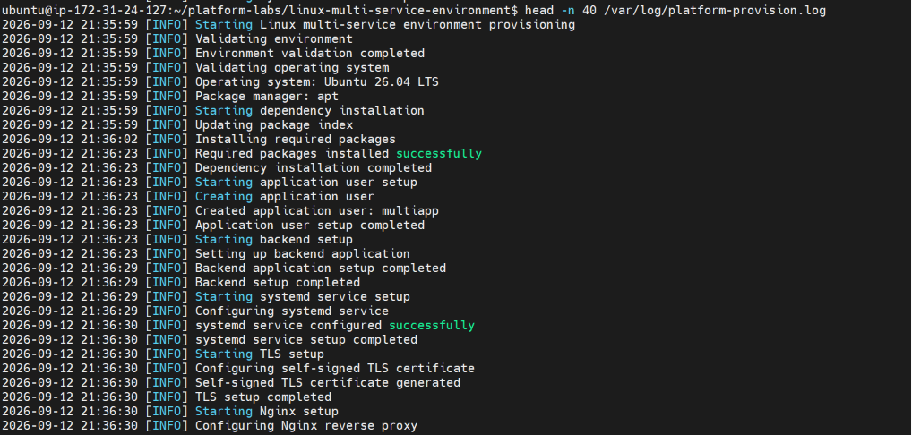

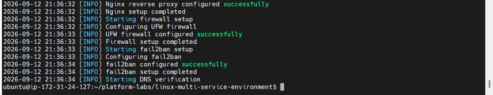

These screenshots show the provisioning logs workflow progressing through its automated setup stages.

Provisioning uses shared logging functionality from:

```text
scripts/common.sh
```

---

# Platform Components

## Flask Application

```text
app/app.py
```

Provides the application layer and health endpoint.

The application runs locally rather than exposing the Flask development server directly to the network.

---

## systemd Service

The application is deployed as a native Linux service:

```text
systemd/multiapp.service
```

This provides service lifecycle management through systemd rather than requiring the application to be launched manually.

### Evidence

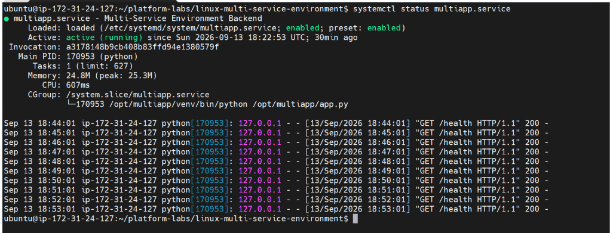

Verify the service with:

```bash
sudo systemctl status multiapp
```

The expected state is:

```text
active (running)
```

---

## Nginx Reverse Proxy and TLS

Nginx provides the controlled entry point to the application:

```text
HTTPS
  │
  ▼
Nginx
  │
  ▼
127.0.0.1:3000
```

TLS configuration is automated through:

```text
scripts/setup_tls.sh
```

The project uses a **self-signed certificate** to keep the environment self-contained and suitable for a lab or infrastructure demonstration. It does not depend on a public certificate authority or a permanent public domain.

### Evidence

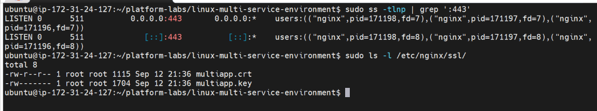

Useful verification commands:

```bash
sudo ss -lntp | grep ':443'
sudo ls -l /etc/nginx/ssl/
```

---

# Security

## UFW Firewall

Firewall configuration is provisioned automatically through:

```text
scripts/setup_firewall.sh
```

The objective is to establish the host-level network access policy as part of the provisioning workflow rather than configure it manually.

### Evidence

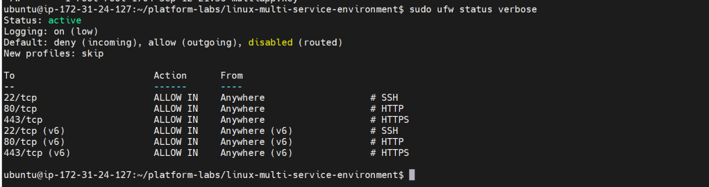

Verify:

```bash
sudo ufw status verbose
```

---

## Fail2ban

Fail2ban provides automated protection against repeated authentication abuse.

Configuration is maintained in:

```text
fail2ban/jail.local
```

and deployed through:

```text
scripts/setup_fail2ban.sh
```

### Evidence

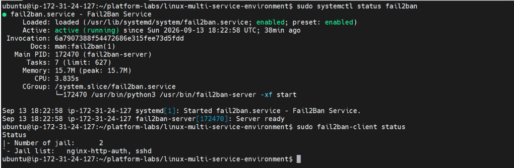

Verify:

```bash
sudo fail2ban-client status
```

The evidence should show the Fail2ban service and configured protection active on the host.

---

# Operations and Observability

## Health Monitoring

Health monitoring is provisioned through:

```text
monitoring/health_check.sh
scripts/setup_monitoring.sh
```

The provisioning process installs:

```text
/usr/local/bin/multiapp-health-check
```

Health-check results are recorded in:

```text
/var/log/multiapp/health-check.log
```

### Evidence

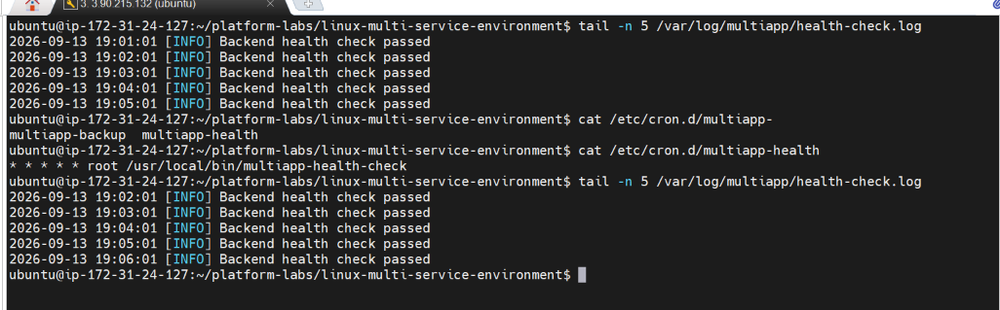

Verify the recorded results:

```bash
sudo cat /var/log/multiapp/health-check.log
```

The screenshot should demonstrate successful automated health checks rather than only showing the source script.

---

## Automated Backups

Backup automation is provisioned through:

```text
scripts/setup_backup.sh
scripts/backup_app.sh
```

The backup utility is deployed as:

```text
/usr/local/bin/multiapp-backup
```

### Evidence

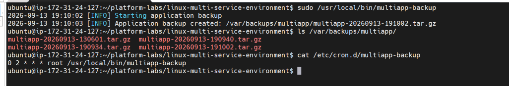

The evidence should demonstrate both:

1. the backup job is scheduled
2. a backup has successfully been created

This verifies the complete backup workflow rather than only the existence of a backup script.

---

## Log Rotation

Log lifecycle management is configured through:

```text
logrotate/multiapp
scripts/setup_logrotate.sh
```

The provisioning workflow deploys the configuration to the host's logrotate configuration.

### Evidence

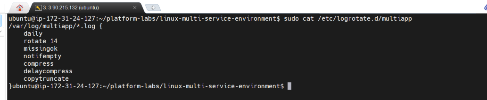

The screenshot should demonstrate the deployed configuration and, where applicable, successful validation or execution.

---


# Provisioning Logs

Provisioning logs are separate from application health logs.

The shared logging functionality is defined in:

```text
scripts/common.sh
```

and used throughout the provisioning workflow.

### Evidence


These screenshots provide evidence that the deployment workflow is executing and reporting its individual stages.

---
# Repository Structure
```
linux-multi-service-environment/
│
├── README.md                         # Project documentation and deployment guide
│
├── app/
│   └── app.py                        # Flask application and HTTP endpoints
│
├── docs/
│   └── images/                       # Project architecture and deployment evidence
│      
│
├── fail2ban/
│   └── jail.local                   # Fail2ban jail configuration
│
├── logrotate/
│   └── multiapp                     # Logrotate policy for application logs
│
├── monitoring/
│   └── health_check.sh              # Application health-check script
│
├── nginx/
│   └── multiapp.conf                # Nginx reverse-proxy configuration
│
├── systemd/
│   └── multiapp.service             # systemd unit for the Flask application
│
├── scripts/
│   ├── backup_app.sh                # Performs application and configuration backups
│   ├── common.sh                    # Shared logging and utility functions
│   ├── install_dependencies.sh      # Installs required system packages
│   ├── setup_app_user.sh            # Creates and configures the application user
│   ├── setup_backend.sh             # Deploys and configures the Flask backend
│   ├── setup_backup.sh              # Installs and schedules automated backups
│   ├── setup_fail2ban.sh            # Configures and enables Fail2ban
│   ├── setup_firewall.sh            # Configures the UFW host firewall
│   ├── setup_logrotate.sh           # Installs the application logrotate policy
│   ├── setup_monitoring.sh          # Deploys and schedules health monitoring
│   ├── setup_nginx.sh               # Configures and enables Nginx
│   ├── setup_systemd.sh             # Installs and enables the systemd service
│   ├── setup_tls.sh                 # Generates and configures the self-signed TLS certificate
│   └── verify_dns.sh                # Validates DNS resolution and reports the resolved IP
│
│
└── provision.sh                      # Main provisioning entry point
```

---

# Engineering Focus

This project demonstrates the operational lifecycle surrounding a Linux-hosted service:

```text
Provision
    ↓
Configure
    ↓
Secure
    ↓
Expose
    ↓
Monitor
    ↓
Maintain
    ↓
Back Up
    ↓
Validate
```

Key engineering practices demonstrated:

- **Modular automation** — individual Bash modules own distinct infrastructure responsibilities.
- **Reproducibility** — the environment can be configured through one provisioning workflow.
- **Service management** — the application is integrated with systemd.
- **Reverse proxying** — Nginx provides the controlled application entry point.
- **TLS** — HTTPS is configured automatically with a self-signed certificate.
- **Host security** — UFW and Fail2ban are included in the automated baseline.
- **Observability** — automated health checks provide operational visibility.
- **Log management** — logging and logrotate address the operational log lifecycle.
- **Backups** — scheduled backups provide a recovery mechanism.
- **Validation** — environment and DNS checks are explicit provisioning stages.

---

# Project Objective

The objective is not simply to deploy a Flask application.

It is to automate the **operational environment around a Linux service** so that deployment, security, service management, monitoring, logging, and recovery are all part of the same reproducible workflow.

```text
                    provision.sh
                         │
          ┌──────────────┼──────────────┐
          │              │              │
     Application       Security      Operations
          │              │              │
        Flask       UFW / Fail2ban   Monitoring
       systemd          TLS          Logrotate
       Nginx                         Backups
          │
          └──────────────┬──────────────┘
                         │
                         ▼
               Reproducible Linux
                Service Environment
```

<p align="center">

**Automated · Modular · Reproducible · Secure · Observable**

</p>
